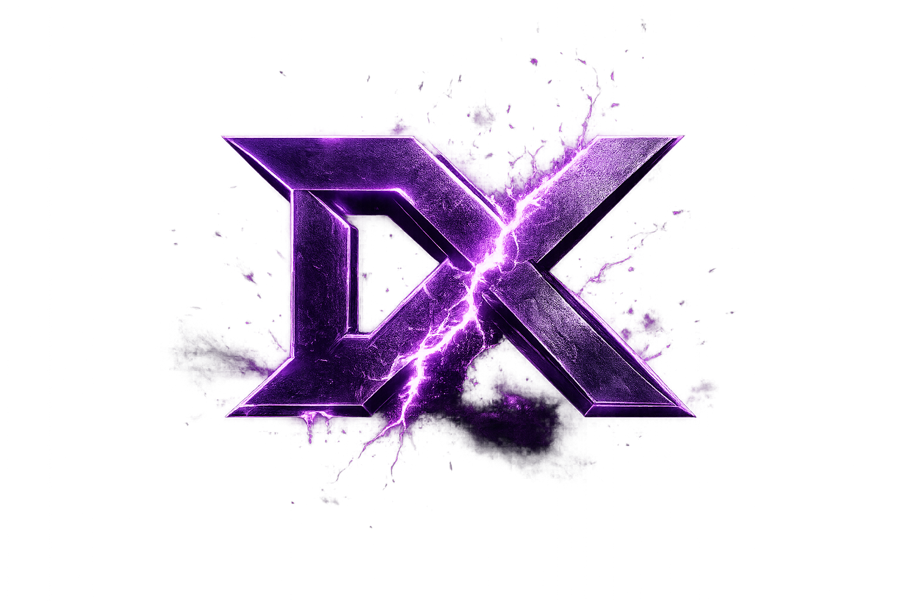

<p align="center">
  
</p>

<p align="center">
  
</p>

<p align="center">
  
</p>

<p align="center">
  <a href="https://git.io/typing-svg">
    
  </a>
</p>

<p align="center">
  
  
  
  
</p>

<p align="center">
  <sub>Clean structure. Smooth motion. Premium DX9 overlay UI.</sub>
</p>

---

## Overview

DXForge is a modern DX9-based Lua UI library for polished overlay interfaces. It is built around a dark-tech visual language, centralized input handling, smooth animation primitives, reusable controls, and a clean API that stays pleasant as menus grow.

## Feature Grid

| Interface | Motion | Systems |
| --- | --- | --- |
| Windows | Startup reveal | Theme management |
| Tabs | Hover transitions | Central input state |
| Groupboxes | Open/close smoothing | Z-index handling |
| Buttons | Slider smoothing | Click-through blocking |
| Toggles | Dropdown animation | Text width caching |
| Sliders | Tooltip fade | Debug-friendly errors |
| Dropdowns | Notification slide/fade | Watermark support |
| Color pickers | Color picker reveal | Extensible component layout |

## Components

```text
Window          Tabs            Groupboxes
Button          Toggle          Slider
Dropdown        MultiDropdown   Textbox
Keybind         ColorPicker     Label
Divider         Tooltip         Notification
Watermark       Theme System    Startup Screen
```

## Install

```lua
local DXForge = _G.DXForge or dofile("DXForge.lua")
```

DX9WARE runs Lua automatically every frame, so cache the library through `_G.DXForge` and call `DXForge:Render()` once per frame/script tick.

## Quick Start

```lua
local DXForge = _G.DXForge or dofile("DXForge.lua")

local Window = DXForge:CreateWindow({
    Title = "DXForge Example",
    Size = {600, 500},
    ToggleKey = "[INSERT]",
    Theme = "Default",
    Resizable = true
})

local MainTab = Window:AddTab("Main")
local CombatBox = MainTab:AddGroupbox("Combat", "left")

CombatBox:AddToggle({
    Text = "Enable Feature",
    Default = false,
    Tooltip = "Toggles the example feature.",
    Callback = function(value)
        print("Toggle:", value)
    end
})

CombatBox:AddSlider({
    Text = "Speed",
    Min = 0,
    Max = 100,
    Default = 50,
    Step = 1,
    Callback = function(value)
        print("Speed:", value)
    end
})

CombatBox:AddDropdown({
    Text = "Mode",
    Values = {"Default", "Aggressive", "Silent"},
    Default = "Default",
    Callback = function(value)
        print("Mode:", value)
    end
})

CombatBox:AddColorPicker({
    Text = "Accent Color",
    Default = {180, 70, 255},
    Callback = function(color)
        print("Color:", color[1], color[2], color[3])
    end
})

DXForge:Notify({
    Text = "DXForge loaded successfully.",
    Type = "Success",
    Duration = 4
})

DXForge:Render()
```

## API Map

| Scope | Method |
| --- | --- |
| Core | `DXForge:CreateWindow(config)` |
| Core | `DXForge:Render()` |
| Core | `DXForge:Notify(config)` |
| Core | `DXForge:RegisterTheme(name, values)` |
| Core | `DXForge:SetTheme(name)` |
| Window | `Window:AddTab(name)` |
| Window | `Window:SetOpen(value)` |
| Window | `Window:Resize(width, height)` |
| Window | `Window:SetSize({width, height})` |
| Window | `Window:SetMinSize({width, height})` |
| Window | `Window:Toggle()` |
| Tab | `Tab:AddGroupbox(name, side)` |
| Groupbox | `Groupbox:AddButton(config)` |
| Groupbox | `Groupbox:AddToggle(config)` |
| Groupbox | `Groupbox:AddSlider(config)` |
| Groupbox | `Groupbox:AddDropdown(config)` |
| Groupbox | `Groupbox:AddMultiDropdown(config)` |
| Groupbox | `Groupbox:AddTextbox(config)` |
| Groupbox | `Groupbox:AddKeybind(config)` |
| Groupbox | `Groupbox:AddColorPicker(config)` |

## Documentation

| Guide | Description |
| --- | --- |
| [Docs Home](docs/README.md) | Start here for the full documentation map. |
| [Getting Started](docs/getting-started.md) | Installation, first window, render loop, and basic setup. |
| [API Reference](docs/api-reference.md) | Core, window, tab, groupbox, and component methods. |
| [Components](docs/components.md) | Practical usage for every included UI control. |
| [Themes](docs/themes.md) | Theme tokens, custom themes, and styling guidance. |
| [Animations](docs/animations.md) | Startup, hover, dropdown, tooltip, and notification motion. |
| [Startup Screen](docs/startup-screen.md) | Loading screen behavior, branding, and configuration. |
| [Notifications & Tooltips](docs/notifications-tooltips.md) | Feedback patterns and hover help. |
| [Input & Windowing](docs/input-windowing.md) | Click handling, focus, z-index, dragging, and resizing. |
| [DX9 Compatibility](docs/dx9-compatibility.md) | Cult-of-Intellect/DX9 API expectations and fallbacks. |
| [Examples](docs/examples.md) | Copy-ready snippets for common menu layouts. |
| [Troubleshooting](docs/troubleshooting.md) | Common mistakes and fixes. |

## Theme Example

```lua
DXForge:RegisterTheme("VioletSteel", {
    FontColor = {238, 238, 246},
    MainColor = {18, 19, 24},
    BackgroundColor = {8, 9, 13},
    AccentColor = {178, 84, 255},
    OutlineColor = {58, 60, 72},
    PanelColor = {25, 26, 34},
    TextMutedColor = {150, 152, 166},
    GlowColor = {145, 60, 255}
})

DXForge:SetTheme("VioletSteel")
```

## Motion Profile

DXForge uses small, consistent animation primitives instead of heavy effects. Startup reveal, hover states, toggle movement, slider smoothing, dropdown expansion, tooltip fade, color picker reveal, and notification slide/fade are all handled through the same animation layer for a more coherent feel.

## Project Layout

```text
DXForge/
|-- assets/
|   |-- DXForgeBanner.png
|   `-- DXForgeSingle.png
|-- DXForge.lua
|-- DXForge.png
|-- LICENSE
`-- README.md
```

## Credits

Created by **PixelGG**.

DXForge is designed as a premium dark-tech DX9 Lua UI library with clean code sections, reliable state handling, and a polished visual identity.

## License

DXForge is licensed under the MIT License. See [LICENSE](LICENSE) for details.

<p align="center">
  
</p>
