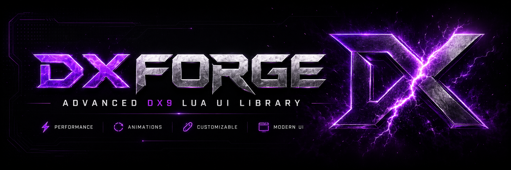

  

  

  

## Documentation Map

| Guide | Use it for |
| --- | --- |
| [Getting Started](getting-started.md) | First setup, first window, first render call. |
| [API Reference](api-reference.md) | Method names, config fields, and return values. |
| [Components](components.md) | Buttons, toggles, sliders, dropdowns, textboxes, keybinds, color pickers, labels, and dividers. |
| [Themes](themes.md) | Custom themes and the default DXForge color tokens. |
| [Animations](animations.md) | Motion behavior, animation consistency, and tuning. |
| [Startup Screen](startup-screen.md) | Loading screen, logo behavior, and PixelGG signature. |
| [Notifications & Tooltips](notifications-tooltips.md) | Feedback messages and hover descriptions. |
| [Input & Windowing](input-windowing.md) | Focus, z-index, dragging, resizing, and click-blocking. |
| [DX9 Compatibility](dx9-compatibility.md) | Cult-of-Intellect/DX9 API expectations and fallbacks. |
| [Examples](examples.md) | Copy-ready complete snippets. |
| [Troubleshooting](troubleshooting.md) | Common setup, DX9, render-loop, and input issues. |

## Recommended Reading Order

1. [Getting Started](getting-started.md)
2. [Components](components.md)
3. [Themes](themes.md)
4. [Animations](animations.md)
5. [Troubleshooting](troubleshooting.md)

## Design Philosophy

DXForge is built for clean overlay interfaces: tight spacing, restrained dark surfaces, neon-purple accents, readable typography, and consistent motion. The docs follow the same idea: fast to scan, practical, and focused on what you need while building.

## Project Info

- Version: `1.0.9`
- Maintainer: `PixelGG`
- License: MIT, copyright `2026 PixelGG`

  

